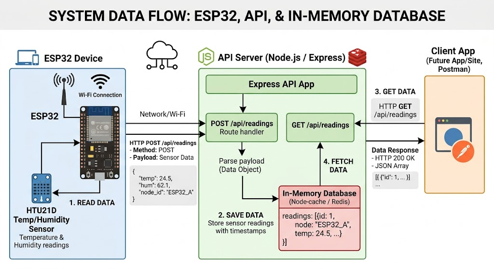

# O que é uma API?

Na prática, uma API é um conjunto de regras que permite a comunicação entre softwares e sistemas digitais. A sigla significa *Application Programming Interface* (Interface de Programação de Aplicações).

Ela define instruções, padrões e rotinas que permitem que diferentes sistemas se comuniquem entre si. Dessa forma, aplicações podem trocar informações e utilizar funcionalidades umas das outras.

Além disso, uma API fornece funcionalidades prontas que podem ser utilizadas por outros sistemas sem que os desenvolvedores precisem conhecer todos os detalhes do código-fonte. Isso economiza tempo e evita que seja necessário “reinventar a roda”.

## Exemplo prático

Imagine um jogo já compilado: normalmente o jogador não consegue acessar ou modificar o funcionamento interno dele. Porém, alguns jogos possuem suporte para mods e oferecem ferramentas como editores de mapas ou itens.

Essas ferramentas funcionam como “portas” de acesso ao sistema do jogo. As APIs funcionam da mesma maneira: elas permitem acessar determinadas funções ou dados de um sistema de forma controlada.

Outra analogia simples é a rede elétrica de uma cidade. Você não consegue alterar o funcionamento da rede, mas pode utilizá-la através das tomadas. A API seria essa “tomada”, permitindo acessar recursos e informações de outro sistema.

---

# O que é REST?

REST (*Representational State Transfer*) é um conjunto de regras e padrões arquiteturais utilizados no desenvolvimento de APIs. REST não é um protocolo, mas sim um modelo de arquitetura.

Quando uma requisição é feita para uma API REST, o servidor envia uma representação do recurso solicitado. Essas informações geralmente são transmitidas utilizando o protocolo HTTP.

Os dados podem ser enviados em diferentes formatos, como:

- JSON
- HTML
- XML
- Texto simples

O formato JSON é o mais utilizado porque é leve, fácil de ler e independente de linguagem.

---

# O que é uma API REST?

Uma API REST (ou RESTful API) é uma API que segue os princípios da arquitetura REST.

Ela organiza a comunicação entre cliente e servidor de forma padronizada, tornando os sistemas mais:

- escaláveis;
- organizados;
- simples de manter;
- fáceis de integrar.

---

# O que é CRUD?

CRUD é um acrônimo muito utilizado na programação para representar as quatro operações básicas realizadas em bancos de dados:

- **Create** → Criar
- **Read** → Ler
- **Update** → Atualizar
- **Delete** → Apagar

Essas operações estão diretamente relacionadas aos métodos HTTP utilizados em APIs REST.

| Operação | Método HTTP |
|---|---|
| Create | POST |
| Read | GET |
| Update | PUT |
| Delete | DELETE |

---

# O que é HTTP?

HTTP (*HyperText Transfer Protocol*) é o protocolo utilizado para a comunicação entre clientes e servidores na internet.

Quando você acessa um site, o navegador envia uma requisição HTTP ao servidor, e o servidor responde com os dados da página.

O HTTP funciona na camada de aplicação da rede e é a base da comunicação na web.

---

# O que são Status Codes?

Os *Status Codes* são códigos de resposta enviados pelo servidor para informar o resultado de uma requisição HTTP.

## Principais códigos HTTP

| Código | Nome | Significado |
|---|---|---|
| 100 | Continue | A requisição pode continuar. |
| 101 | Switching Protocols | O servidor está trocando de protocolo. |
| 200 | OK | A requisição foi concluída com sucesso. |
| 201 | Created | Um novo recurso foi criado com sucesso. |
| 204 | No Content | A requisição foi concluída sem retornar conteúdo. |
| 400 | Bad Request | A requisição possui erro do cliente. |
| 404 | Not Found | O recurso solicitado não foi encontrado. |
| 500 | Internal Server Error | O servidor encontrou um erro interno. |
| 502 | Bad Gateway | O servidor recebeu uma resposta inválida de outro servidor. |

---

# O que é JSON?

JSON (*JavaScript Object Notation*) é um formato de texto utilizado para armazenar e transportar dados.

Ele é muito utilizado em APIs porque é:

- leve;
- simples;
- fácil de ler;
- compatível com diversas linguagens.

## Exemplo de JSON

```json
{
  "nome": "João",
  "idade": 20,
  "cidade": "São Paulo"
}
```

O JSON é atualmente um dos formatos mais utilizados para troca de dados entre sistemas e aplicações web.

---

# Documentação da API

Base URL:

```txt
http://localhost:3000
```

---

# GET /api/dados

## Descrição
Retorna todos os dados dos sensores.

## Exemplo de requisição

```http
GET http://localhost:3000/api/dados
```

## Resposta de sucesso

```txt
200 OK
```

```json
[
  {
    "id": 1,
    "temperatura": 30,
    "umidade": 40,
    "hora": "09:00"
  }
]
```

---

# GET /api/dados/:id

## Descrição
Retorna os dados de um sensor pelo ID.

## Parâmetros

| Parâmetro | Tipo |
|---|---|
| id | Number |

## Exemplo de requisição

```http
GET http://localhost:3000/api/dados/1
```

## Resposta de sucesso

```txt
200 OK
```

```json
{
  "id": 1,
  "temperatura": 30,
  "umidade": 40,
  "hora": "09:00"
}
```

## Resposta de erro

```txt
404 Not Found
```

```json
{
  "mensagem": "ID não encontrado!"
}
```

---

# POST /api/dados

## Descrição
Adiciona novos dados ao histórico.

## Exemplo de requisição

```http
POST http://localhost:3000/api/dados
```

```json
{
  "temperatura": 25,
  "umidade": 60,
  "hora": "12:00"
}
```

## Resposta de sucesso

```txt
201 Created
```

```json
{
  "mensagem": "Dados enviados com suceso!"
}
```

## Resposta de erro

```txt
400 Bad Request
```

```json
{
  "mensagem": "Dados incompletos! Verifique e tente novamente!"
}
```

---

# PUT /api/dados/:id

## Descrição
Atualiza os dados de um sensor.

## Exemplo de requisição

```http
PUT http://localhost:3000/api/dados/1
```

```json
{
  "temperatura": 28,
  "umidade": 50,
  "hora": "13:00"
}
```

## Resposta de sucesso

```txt
200 OK
```

```json
{
  "mensagem": "Dados atualizados com sucesso!"
}
```

## Resposta de erro

```txt
404 Not Found
```

```json
{
  "mensagem": "Não é possível atualizar um dado inexistente!"
}
```

---

# DELETE /api/dados/:id

## Descrição
Remove um sensor do histórico.

## Exemplo de requisição

```http
DELETE http://localhost:3000/api/dados/1
```

## Resposta de sucesso

```txt
200 OK
```

```json
{
  "mensagem": "Dados excluídos com sucesso!"
}
```

## Resposta de erro

```txt
404 Not Found
```

```json
{
  "mensagem": "Não é possível excluir um dado inexistente!"
}
```

# Diagrama do Fluxo do Sistema



---

# Fluxo do sistema

1. O ESP32 coleta os dados dos sensores.
2. Os dados são enviados para a API usando `POST`.
3. A API armazena os dados no banco em memória.
4. O cliente (Postman/site/app) faz requisições `GET`, `PUT` e `DELETE`.
5. A API retorna os dados em formato JSON.

# RODAR E REFLEXÃO

---

#  Como rodar

## Pré-requisitos

- Node.js versão 18 ou superior
- npm instalado

---

## Instalação

```bash
npm install
```

---

## Rodando o servidor

```bash
node server.js
```

---

## Como saber se está funcionando

Se aparecer a mensagem abaixo no terminal, a API está funcionando:

```txt
Servidor rodando na porta 3000
```

---

## Como testar

Usando o Postman:

### Exemplo

```http
GET http://localhost:3000/api/dados
```

Resposta esperada:

```json
[
  {
    "id": 1,
    "temperatura": 30,
    "umidade": 40,
    "hora": "09:00"
  }
]
```

---

# Tecnologias usadas

- **Node.js** — ambiente que executa JavaScript no servidor.
- **Express.js** — framework utilizado para criar a API.
- **CORS** — permite comunicação entre diferentes aplicações.
- **JSON** — formato utilizado para troca de dados.
- **Postman** — ferramenta utilizada para testar a API.

---

# Reflexão

O que mais gostei foi aprender um pouco mais sobre java e testar as requisições mas um vez Postman. Foi interessante ver os dados sendo enviados e recebidos em JSON.

As maiores dificuldades foram saber onde tava o erro de cada coisa no codigo